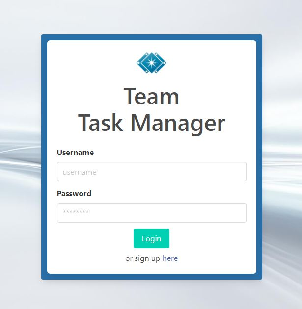
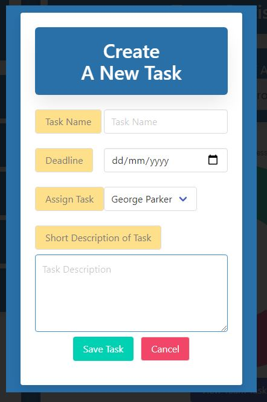
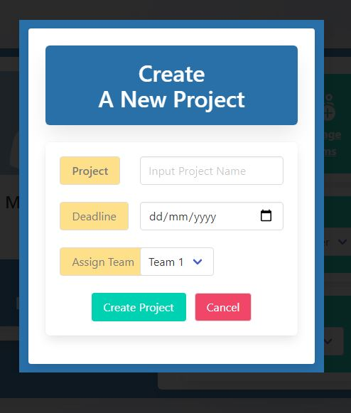
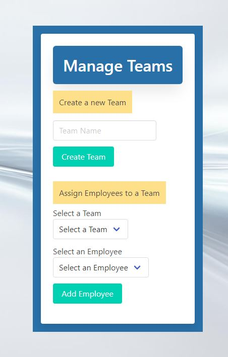
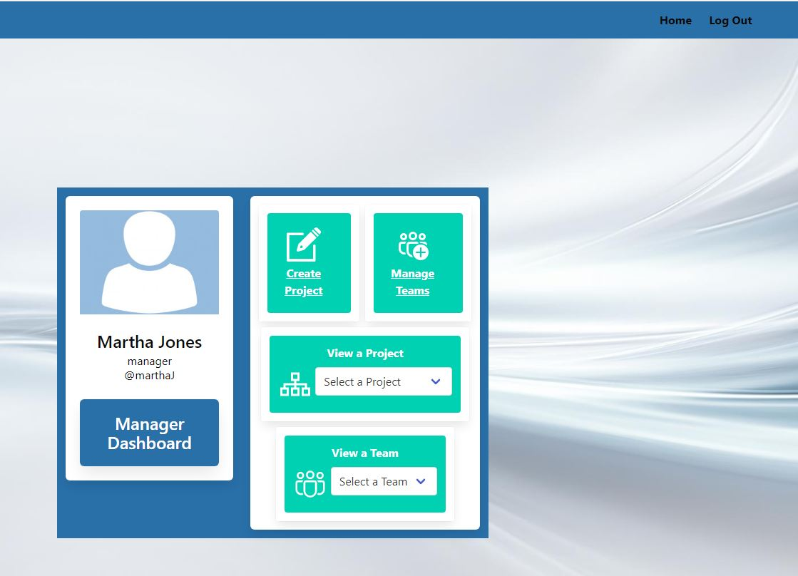
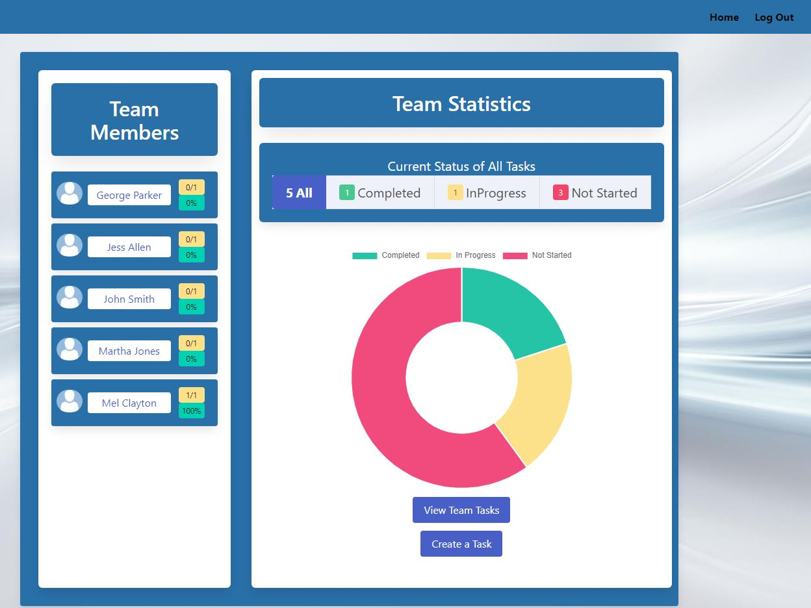

# Team Task Manager Web Application


## Table of Contents:

- [Git-Repository](#git-repository)
- [Demo-Video](#walktrough-video)
- [Description](#description)
- [User-story](#user-story)
- [Installation](#installation)
- [Usage](#usage)
- [License](#license)
- [Contributing](#contributing)
- [Questions](#questions)
- [Screenshots](#screenshots)

## Git Repository

The git repository folder that is hosting the project can be found
[here](https://github.com/AidKool/team-task-manager)

## Link to the walktrough video

Application video [demo]()

## Description:

This project required to build a full Node.js web application using the MVC (
Model-View-Controller ) design pattern in its architectural structure, It will
use Handlebars.js as the templating language, Sequelize as the ORM, the
express-session npm package for authentication and the live application deployed
on Heroku.

This Project is about developing a Team Task Manager application that will allow
a user to sign up into the app. Based on the user role , he will be redirected
to a particular page which is Manager page or employee page. From the Employee
page the user will be able to view his team members , all task allocated to each
team member, statistics about the completion of each task and create additional
tasks. The user with the manage role when login will be redirected to the
manager page. From its page , the manager will be able to view all projects ,
all existing Team, create project, create a Team and allocated each employee to
a selected team.

## User story

```md
AS A developer who writes about tech I WANT a web application SO THAT Users can
manage projects,Teams and tasks.
```

```md
AS A USER WHEN I am presented with the option to login or to sign up. WHEN I
choose to sign up THEN I am prompted with a form to register as an employee.
WHEN I click to the home page button THEN I am taken to the homepage with the
option to login. WHEN I enter a username and password THEN I am directed to an
employee page or manager page.
```

```md
AS A USER WHEN I login as an employee , i am presented with the option to view
all team members or all team tasks. WHEN i clicked on the button view team THEN
I am presented with a list of team members, team tasks statistics and an option
to create tasks. WHEN i looked at the statistics THEN i am presented with a
chart and table that tell me statut of completion of all tasks. WHEN i click on
the create task button THEN i am prompted to enter the task name , deadline, an
option to choose the team member to assign the task to, and a task description.
```

```md
AS A USER WHEN I login as a manager , I am presented with the option to view the
list of projects, a list of all teams, an option to create a project and to
manage teams. WHEN i select a project from the list THEN i am directed to a page
giving statistics about the project completion. WHEN i select a team THEN i am
presented with a page with the list of team members and statistics about tasks
allocated. WHEN I click on create project THEN I am prompted to enter the
project name, deadline and assign it to an existing team. WHEN I click on manage
team THEN I am prompted with the option to create a team or to assign an
employee to a team.
```

## Installation:

---

Run this command to install dependencies:

  <pre><code>
  npm install
  </code></pre>

## Usage:

---

Run this command to start the app:

  <pre><code>
  npm run watch
  </code></pre>

## License:

[License: MIT](https://opensource.org/licenses/MIT)

# This Project is licensed under the MIT license

## Contributing:

Project is opened for contributions.

## Questions:

- **Developer-1 Contact details:**

  - Github: [@AidKool](https://github.com/AidKool)

  - Github: [@DaveyDavey1901](https://github.com/DaveyDavey1901)

  - Github: [@mattmc86](https://github.com/mattmc86)

  - Github: [@pfansi](https://github.com/pfansi)

## Screenshots

- Screenshot of the Homepage or login page

  

- Screenshot of the create task form

  

- Screenshot of the create project form

  

- Screenshot of the manage team form

  

- Screenshot of the Manager page

  

- Screenshot of the Team page

  
